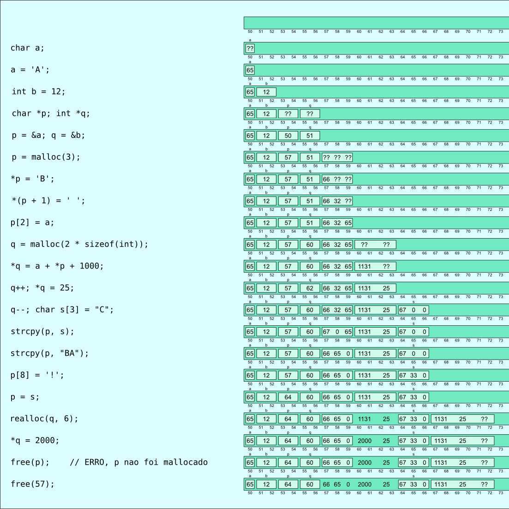

## Tempo de vida, escopo, visibilidade

Antes de falarmos de alocação dinâmica de memória, vamos falar sobre alguns conceitos importantes que ajudam a entender a sua utilidade.

### Tempo de vida

O tempo de vida de uma variável é o tempo durante o qual existe um vínculo entre essa variável e uma região de memória para conter o seu valor. Existem dois tipos de tempo de vida em C, "estático" e "automático".

Variáveis com tempo de vida estático existem durante todo o tempo de execução do programa. A memória é vinculada à variável e inicializada quando o programa inicia a execução e só devolvida ao sistema quando o programa encerra sua execução. Se a variável tem uma inicialização na sua declaração, esse é o valor usado para sua inicialização. Caso contrário, as variáveis estáticas são inicializadas com o valor 0 (que equivale a NULL no caso de ponteiros).

Variáveis com tempo de vida automático têm sua memória alocada somente quando o seu escopo inicia a execução e liberada quando seu escopo termina sua execução. O escopo de uma variável automática é o bloco onde ela foi declarada.
Uma variável automática só é inicializada se a sua declaração contém uma inicialização, caso contrário o conteúdo da memória que foi escolhida para ela não é alterado. A memória escolhida para uma variável automática pode ser diferente a cada alocação.

Variáveis declaradas fora de funções são sempre estáticas.
Variáveis declaradas como argumentos de funções são sempre automáticas.
Variáveis declaradas dentro de funções são geralmente automáticas, a não ser que sejam declaradas com `static` no início do comando de declaração.
Funções são sempre estáticas.

### Escopo

O escopo de uma variável é a região de código onde essa variável existe e pode ser manipulada.
O escopo pode ser:
- de arquivo;
- de função;
- de bloco ou
- de parâmetros.

O **escopo de arquivo** só existe para variáveis definidas fora de funções.
Esse escopo às vezes é chamado de global, e tais variáveis são chamadas de variáveis globais.
Uma variável de escopo de arquivo pode ser manipulada por todo o código entre a declaração dessa variável e o final do arquivo (qualquer função).

Por causa dessa liberdade, pode ser difícil rastrear todos os usos de uma variável global, dificultando a leitura de programas que as utilizam.
O uso de variáveis globais deve ser restrito ao mínimo.

O **escopo de bloco** inicia na declaração da variável e termina na chave que termina o bloco que contém essa declaração.
Variáveis declaradas nos parênteses de comando `for` são consideradas como pertencentes ao bloco do `for`.
Variáveis que são parâmetros de funções são consideradas como pertencentes ao bloco principal da função.

Os demais escopos só existem para casos bem restritos, detalhes que não vêm ao caso agora.

### Visibilidade

O conceito de visibilidade é bem semelhante ao de escopo, é o trecho de código no qual uma variável é visível e pode ser manipulada diretamente.
Não é o mesmo conceito quando a declaração de uma variável esconde outra variável de mesmo nome, tornando-a invisível, apesar de ainda estar em seu escopo e poder ser manipulada indiretamente (através de um ponteiro, por exemplo).
No código abaixo, a primeira variável `i`, apesar de ter escopo global, não é visível entre a declaração da segunda variável `i` e o final do bloco onde ela é declarada. A função abaixo imprime `10 10 0 10 1 10`.
```c
int f() {
    int i = 10;
    printf("%d ", i);
    for (int j = 0; j < 2; j++) {
        printf("%d ", i);
        int i = j;
        printf("%d ", i);
    }
    printf("%d ", i);
}
```

Uma variável global definida com `static` só é visível no arquivo onde é definida.
Uma variável global definida sem `static` pode ser vista em outro arquivo se for declarada nesse outro arquivo como `extern`.
Não pode haver duas definições de variável global sem `static` com o mesmo nome no mesmo programa; a declaração de uma variável como `extern` não define a variável, só diz que ela deve existir uma definição para ela em outro lugar, com o mesmo tipo.

Uma função declarada como `static` só é visível no arquivo onde é definida.
Uma função definida sem `static` pode ser vista em outro arquivo se for declarada nesse outro arquivo.
Não pode haver duas definições de função sem `static` com o mesmo nome no mesmo programa; a declaração sozinha de uma função não define a variável, só diz que ela deve existir uma definição para ela em outro lugar, com o mesmo tipo de retorno e os mesmos tipos de parâmetros.
A declaração de uma função é como a definição, só que sem o bloco e com um `;` no final. Por exemplo, a declaração abaixo diz que em algum lugar, neste mesmo arquivo ou em outro, vai haver a definição da função `f` que retorna um `int` e não recebe parâmetro.
```
int f();
```

## Alocação dinâmica de memória

As formas de gerenciamento de memória com o uso de variáveis na linguagem C foi considerada muito restritiva:
- não é possível declarar uma variável em uma função para usar em outra (a variável tem tempo de vida automático e é destruída quando a função retorna);
- não é possível ter uma variável global cujo tamanho seja definido durante a execução do programa - variáveis globais têm alocação estática, que é realizada antes da execução de `main` iniciar, e não pode ser alterada depois.

Se desenvolveu então uma outra forma de se gerenciar a memória, que desvincula o tempo de vida da memória do tempo de execução de uma função, dando mais liberdade ao programador. Essa forma é chamada de alocação dinâmica de memória, é implementada por funções e o controle da memória.

Nessa forma de alocação de memória, é o programador quem realiza a alocação e a liberação da memória, no momento que considerar mais adequado.
Essa memória é por vezes chamada de anônima, porque não é vinculada a uma variável com nome pré-definido.

Como essa memória não é associada a variáveis, a forma que se tem para usar esse tipo de memória é através de ponteiros.

Existem duas operações principais de manipulação desse tipo de memória: a operação de alocação e a operação de liberação de memória.
Quando se aloca memória, se diz quanto de memória se quer (quantos bytes), e se recebe do sistema esse tanto de memória, na forma de um ponteiro para a primeira posição do bloco de memória alocado. As demais posições seguem essa primeira, de forma contígua, como em um vetor.
Para se liberar a memória, passa-se um ponteiro para essa mesma posição, o sistema sabe quanto de memória foi alocada e faz o necessário para disponibilizar essa memória para outros usos.
Depois de liberado, o bloco de memória não pode mais ser utilizado.

Essas operações estão disponibilizadas em C na forma de funções, acessíveis incluindo-se `stdlib.h`.
As principais funções são `malloc` e `free`.
A função `malloc` recebe um único argumento, que é a quantidade de bytes que se deseja, e retorna um ponteiro para a região alocada, que tem esse número de bytes disponíveis. Caso a alocação não seja possível, o ponteiro retornado tem um valor especial, chamado `NULL`. Sempre deve-se testar o valor retornado por `malloc` para verificar se a alocação de memória foi bem sucedida.

A função `free` recebe um único argumento, que é um ponteiro para a primeira posição de memória do bloco a ser liberado, obrigatoriamente o mesmo valor retornado por um pedido de alocação de memória anterior. A função `free` não pode liberar qualquer memória, somente blocos alocados com `malloc`.

Não existe limitação no tamanho de um bloco a alocar, nem na quantidade de blocos alocados, a não ser a quantidade de memória disponível no sistema.

Para facilitar o cálculo da quantidade de memória, existe o operador `sizeof`, que fornece o número de bytes usado por qualquer tipo de dados. Por exemplo, `sizeof(double)` diz quantos bytes de memória são necessários para se armazenar um valor do tipo `double`.

Por exemplo, para alocar memória para um double e colocar o valor 2.54 nessa memória, podemos fazer:
```c
   double *p;
   p = malloc(sizeof(double));
   if (p == NULL) {
     aborta_com_erro("memória insuficiente!");
   }
   *p = 2.54;
   // ...
```

Para se alocar memória para uma estrutura ponto:
```c
   typedef struct {
     float x;
     float y;
   } ponto;
   
   ponto *p = malloc(sizeof(ponto));
   if (p == NULL) {...}
   p->x = 10;
   p->y = -2.5;
   // ... 
   free(p);   // a memória não é mais necessária - libera para ser reutilizada.
```

Um pouco mais útil é alocar memória para vários dados do mesmo tipo. Por exemplo, para alocar memória para colocar um milhão de inteiros:
```c
   int *p;
   p = malloc(1000000 * sizeof(int));
   // ...
```
Agora temos uma região de memória onde cabem um milhão de inteiros, e temos um ponteiro apontando para o primeiro deles.
Como acessar os demais?
A memória alocada é contígua, os demais inteiros estão em posições subsequentes da memória, após aquele que é apontado diretamente pelo ponteiro. Em C, se temos um ponteiro apontando para um dado de um determinado tipo que está em certa posição de memória, podemos ter um ponteiro para a posição do dado seguinte somando 1 ao ponteiro:
```c
   int v[10];
   int *p;
   p = &v[4];      // p aponta para v[4]
   int *q;
   q = p + 1;      // q aponta para v[5]
   q -= 4;         // agora q aponta para v[1]
   *q = 5;         // armazena 5 em v[1]
   *(p - 3) = 10;  // armazena 10 em v[1]
   int x = p - q;  // x vale 3
```
Essas operações são chamadas de **aritmética de ponteiros**. Tem 3 operações definidas: soma ou subtração de um inteiro a um ponteiro (resulta em um ponteiro para um dado que está tantas posições distante do dado apontado pelo ponteiro) e subtração de ponteiros (resulta em um inteiro que representa o número de dados desse tipo que podem ser colocados na região de memória entre os ponteiros). Os ponteiros participantes dessas operações devem referir-se a uma mesma região de memória, e apontar para dados do mesmo tipo.

Com o uso de aritmética de ponteiros, podemos acessar os vários valores de uma região alocada por malloc:
```c
   int *p;
   p = malloc(1000000 * sizeof(int));
   if (p == NULL) {...}
   for (int i = 0; i < 1000000; i++) {
     *(p + i) = rand();
   }
```
Cuidado com os parênteses! O que faz `*(p + i) = *p + i`?

Essa forma de acesso a dados através de ponteiros é tão comum que se criou uma notação especial, para não ser necessário usar os parênteses. `*(p + i)` pode ser escrito como `p[i]`.
Em outras palavras, pode-se usar uma região de memória alocada para vários dados do mesmo tipo como se fosse um vetor.
(O contrário também é verdade, se `v` é um vetor, pode-se usar a notação `*(v + 2)` para se acessar seu segundo elemento, mas quase ninguém usa isso).

O código acima poderia ser:
```c
   int *p;
   p = malloc(1000000*sizeof(int));
   if (p == NULL) {...}
   for (int i = 0; i < 1000000; i++) {
     p[i] = rand();
   }
```

Como a memória alocada é contígua, uma forma usual de se usar a memória alocada é como um vetor. Como vimos anteriormente, o uso de um vetor através de um ponteiro é muito semelhante (pra não dizer igual) ao uso de um vetor diretamente. O fato de o ponteiro estar apontando para memória alocada explicitamente ou estar apontando para memória que pertence a um vetor de verdade não muda a forma de uso.

Por exemplo, para se alocar memória para se usar como um vetor de tamanho definido pelos dados, pode-se usar algo como:

```c
#include <stdio.h>
#include <stdlib.h>

float calcula(int n, float v[n])
{
  // faz um cálculo complicado sobre os elementos do vetor
  float t = 0;
  for (int i = 0; i < n; i++) {
    t += v[i];
  }
  return t / n;
}

int main()
{
  float *vet;
  int n;
  printf("Quantos dados? ");
  scanf("%d" , &n);

  vet = malloc(n * sizeof(float));
  if (vet == NULL) {
    desiste("Memória insuficiente");
  }

  // a partir daqui, vet pode ser usado como se fosse um vetor de tamanho n
  for (int i = 0; i < n; i++) {
    printf("digite o dado %d ", i);
    scanf("%f", &vet[i]);
  }
  float resultado = calcula(n, vet);
  printf("O resultado do cálculo é: %f\n", resultado);
  free(vet);
  // a partir daqui, a região apontada por vet não pode mais ser usada.
  return 0;
}
```
O operador `sizeof` pode ser usado em uma variável (retorna quantos bytes ela ocupa) ou em um tipo qualquer (retorna quantos bytes uma variável desse tipo ocuparia). Pode-se usar ele para saber o tamanho de um vetor de determinado tipo. Daria para substituir `malloc(n * sizeof(double))` por `malloc(sizeof(double[n]))`.

### Exercício

1. Faça uma função que recebe o nome de um arquivo contendo valores `float` e retorna um vetor dinamicamente alocado preenchido com os números contidos no arquivo. A função deve também retornar o tamanho do vetor. Faça um programa para testar essa função, que calcula e imprime a média desses valores (usando a função `calcula` do exemplo acima). O número de valores no arquivo está no início do arquivo. Por exemplo, se o arquivo contém os dados "7 14.5 13", o conteúdo do arquivo seria "3 7 14.5 13".


### Realocação de memória

As vezes, após se alocar memória e usá-la para colocar dados, as necessidades do programa (em termos da quantidade de memória para esses dados) mudam.
Para esses casos, existe uma função que permite alterar a quantidade de memória de uma região previamente alocada.
A função se chama `realloc`, e recebe como parâmetros um ponteiro para uma região previamente alocada e o novo tamanho que se quer para essa região.
A função não tem como garantir que existe memória disponível logo após a região afetada, ou, mesmo que exista, pode achar mais conveniente usar uma outra região. Nesse caso, ela aloca memória em outro lugar, copia o conteúdo da região original para a nova região e libera a região original para ser reutilizada.
Por causa disso, `realloc` retorna um ponteiro para a nova região (que pode ser igual à antiga).
Além disso, pode ser que a alocação não seja possível, e nesse caso a região antiga não é afetada, e `realloc` retorna NULL.
Então, quando se usa realloc, é necessário gerenciar esses 2 ponteiros. Uma forma de se fazer isso:
```c
   ponto *p = malloc(n * sizeof(ponto));
   /// usa a área apontada por p
   /// ops, a área está muito pequena!
   ponto *np = realloc(p, nn * sizeof(ponto));
   if (np == NULL) {
     // OPS, não deu para aumentar, dá para desistir ou continuar com o que tem em p
   } else {
     // a realocação foi possível, o valor de p pode ser inválido, o que vale é np
     // para continuar usando essa área como p, faz p apontar para a nova área
     p = np;
     // np não é mais necessário
   }
```
A função `realloc` pode ser utilizada para aumentar ou para diminuir uma região de memória alocada. Os valores originais são mantidos na nova área, até o tamanho da nova área, se ela for menor que a antiga (perdendo parte dos dados), ou até o tamanho da área antiga, se a nova for maior (o restante da área nova fica não inicializado).

Uma função alternativa de alocação, por vezes preferível em relação à malloc porque inicializa a memória alocada com zeros e deixa mais explícita a intenção de se alocar um vetor é calloc. Em vez de `p = malloc(n * sizeof(xis))`, pode-se usar `p = calloc(n, sizeof(xis))`.

O desenho abaixo pode ajudar... (A última linha é bobagem, de onde tiraria o 57? Na prática a memória em 57 seria perdida.) Esse desenho é uma simplificação em relação ao que acontece geralmente em um sistema real de alocação de memória.



A alocação dinâmica e o acesso indireto à memória usando ponteiros são considerados fontes comuns de defeitos em programas. As regras são simples:
- um ponteiro só pode ser dereferenciado quando aponta para memória "viva", que pertence a uma variável cujo tempo de vida não expirou, ou que pertence a uma região alocada dinamicamente que ainda não foi liberada.
- para evitar consumo excessivo de memória, o tempo de vida de uma variável (ou de memória alocada dinamicamente) não deve exceder demais seu último acesso.

Falhas em seguir a primeira regra podem causar os mais variados comportamentos indesejados, por representar acesso a região de memória fora da variável que se queria acessar, que não se sabe para que está sendo utilizada. O caso mais comum é acessar o índice `n` de um vetor de tamanho `n`.

Outro caso comum é acessar uma variável para a qual se tem um ponteiro após essa variável ter sido liberada, que pode ser por um `free` no caso de alocação dinâmica ou um erro como:
```c
char *int_para_str(int a)
{
  char s[20];
  // formata o número a como uma string em s
  return s;
}
```
Em C não existe retorno de vetor, é retornado um ponteiro para o primeiro elemento. Como o vetor é local à função, vai ser liberado quando a função terminar, e quem receber o ponteiro retornado tem um ponteiro apontando para uma região de memória liberada, que não deve ser dereferenciado.

A segunda regra leva a se evitar variáveis estáticas, e a se liberar a memória alocada com malloc o quanto antes. Nem sempre é fácil identificar o ponto onde uma variável não será mais necessária, principalmente onde o controle da memória é mais complicado, envolvendo diversos ponteiros para as mesmas regiões de memória. A liberação muito cedo pode levar a erros de acesso à memória liberada; a liberação muito tarde pode levar ao consumo excessivo de memória e necessidade de reinicialização de programas de longa duração.

Como poderia ser corrigida a função acima?
1. com alocação estática:
```c
char *int_para_str(int a)
{
  static char s[20];
  // formata o número a como uma string em s
  return s;
}
```
   Agora, o ponteiro retornado aponta para uma região de memória viva, e pode ser usado depois do retorno da função. O problema é que, se a função for chamada outra vez, essa região é alterada. Não dá para fazer, por exemplo:
```c
  printf("a=%s, b=%s\n", int_para_str(a), int_para_str(b));
```
   Nem mesmo
```c
  char *sa, *sb;
  sa = int_para_str(a);
  sb = int_para_str(b);
  printf("a=%s, b=%s\n", sa, sb);
```
2. Com alocação dinâmica, a função poderia ser escrita assim:
```c
char *int_para_str(int a)
{
  char *s;
  s = malloc(20);
  if (s != NULL) {
    // formata o número a como uma string em s
  }
  return s;
}
```
O problema agora é que quem chama essa função tem o compromisso de liberar a memória recebida.
